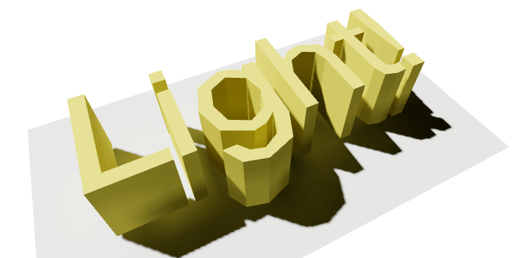

# @react-three/lightmap

**In-browser lightmap and ambient occlusion (AO map) baker for react-three-fiber and ThreeJS.**



[See example live editable sandbox](https://codesandbox.io/s/github/pmndrs/react-three-lightmap/tree/v0.0.2/demo-sandbox).

NOTE: if you are using `mode="legacy"` on your `<Canvas>` tag please add `legacySuspense` flag to the lightmap, otherwise it will not wait until your scene content is fully loaded. This is not an issue in most situations, unless you have explicitly set the mode prop on `<Canvas>`.

## Local Development

```sh
git clone git@github.com:pmndrs/react-three-lightmap.git
cd react-three-lightmap
yarn
yarn storybook
```

## Notes

Based on [original experimental implementation](https://github.com/unframework/threejs-lightmap-baker) by [@unframework](https://github.com/unframework).
